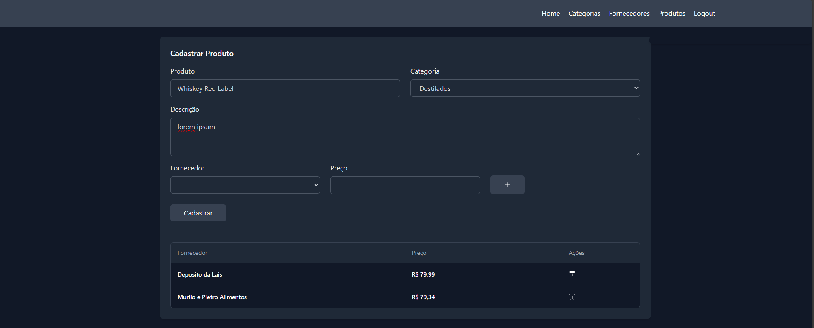

# CRUD PRODUTOS E FORNECEDORES

## Stacks:

* [Django 4.2.3](https://www.djangoproject.com/)
* [django-rest-framework](https://www.django-rest-framework.org/))
* [Vuejs](https://vuejs.org/)

## Como rodar o projeto?
```
git clone https://github.com/LeoBastos/DRF-Vue.git

c:\> cd DRF-Vue

## backend:
entre no diretório backend do projeto:
c:\DRF-Vue> cd backend

python -m venv .venv
Windows: c:\>venv\Scripts\activate
pip install -r requirements.txt

Crie um arquivo .env dentro das pasta core e coloque as informações abaixo:  (https://django-environ.readthedocs.io/)
DEBUG=True
SECRET_KEY=


python manage.py makemigrations
python manage.py migrate
python manage.py createsuperuser

## frontend:
c:\DRF-Vue> cd frontend
c:\DRF-Vue\frontend> npm install
c:\DRF-Vue\frontend> npm run dev

## Links:
Admin Django: http://127.0.0.1:8000/admin
Api Swagger: http://127.0.0.1:8000/api/swagger

```

# :camera: Screenshots
<div align="center">    
   
   
      
  
      
  
      
</div>

